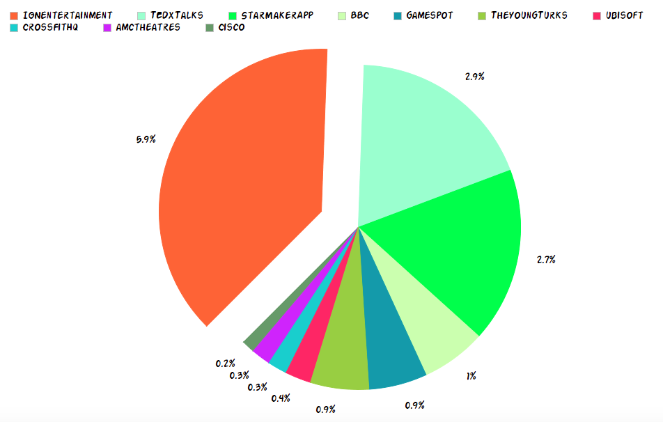
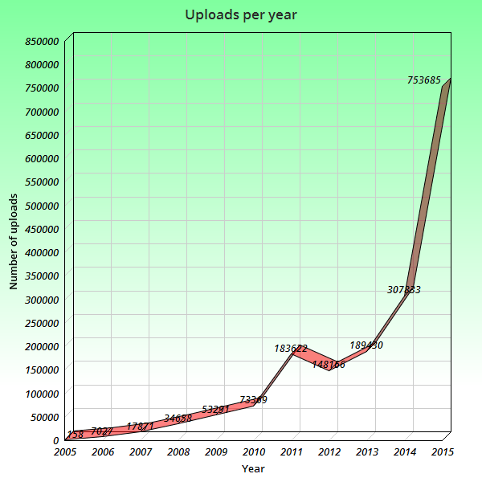
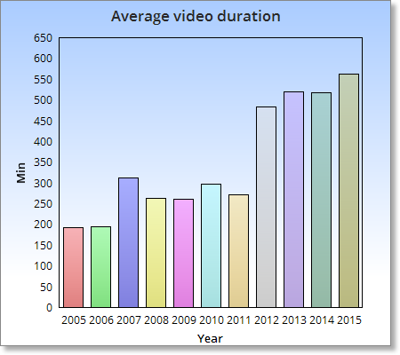

####Zadania

#####Dane

Ściągamy json stąd: https://dl.dropboxusercontent.com/u/15056258/mongodb/media.zip 

Json zawiera 1,769,759 rekordów

#####Import do mongo
Zapisujemy dane poleceniem : 

```sh
mongorestore --drop -d test -c youtube /Users/aidem/Desktop/zadanie1neo4js/Data/media/youtube.bson
```
Sprawdzamy przykladowy rekord:
```javascript   
> db.youtube.findOne()
{
	"_id" : ObjectId("55f15665c7447c3da70b5519"),
	"id" : "--0zjb5SZck",
	"uploader" : "FCLEANDROELEONARDO",
	"upload_date" : "2011-08-30",
	"title" : "Leandro & Leonardo - Cerveja - Videoclipe Oficial",
	"description" : "Videoclipe Oficial Da Música \" Cerveja \" Em 1997 ! Pra Matar As Saudades !!!",
	"duration" : "204",
}
```

#####Aby wykonać jakieś ciekawe agregacje, musimy najpierw przekonwertowac nasze dane ze stringow:
	
#####Zamieniamy pole "duration" na wartosc INT i zapisujemy w polu durationtonumber:

```javascript 	
	db.youtube.find().forEach(function(doc) {
	doc.durationtonumber = new NumberInt(doc.duration);
    	db.youtube.save(doc);
	});
```	

#####Następnie pole "upload_date" na wartosc DATE i zapisujemy w polu uploadtodate:

```javascript 	
	db.youtube.find().forEach(function(doc) {
    	doc.uploadtodate = new Date(doc.upload_date);
    	db.youtube.save(doc);
	});
```	

#####Teraz nasz dane wyglądają tak:

```javascript
	> db.youtube.findOne()
{
	"_id" : ObjectId("55f15665c7447c3da70b5519"),
	"id" : "--0zjb5SZck",
	"uploader" : "FCLEANDROELEONARDO",
	"upload_date" : "2011-08-30",
	"title" : "Leandro & Leonardo - Cerveja - Videoclipe Oficial",
	"description" : "Videoclipe Oficial Da Música \" Cerveja \" Em 1997 ! Pra Matar As Saudades !!!",
	"duration" : "204",
	"durationtonumber" : 204,
	"uploadtodate" : ISODate("2011-08-30T00:00:00Z")
}
```

Ciekawostka: obie operacje zajęły około 20 minut, dla wszystkich 1769759 rekordów.

####Agregacje java script

#####Przykładowe agregacje w javascript:
	
#####1. Zwróć całkowitą sumę długości wszystkich filmów wrzuconych na youtube:

```javascript 	
	>db.youtube.aggregate({$group:{_id:"result",length:{$sum: "$durationtonumber"}}})
```
```javascript 
	{ "_id" : "Total", "length" : 855414093 }
```

Jest to suma długości wszystkich filmów wrzuconych na youtube w minutach. W sumie:  ~ 14,256,901 godzin.
	
#####2. Wyświetl 10 najbardziej aktywnych uploaderów:
 
```javascript 	
db.youtube.aggregate({ $group: { _id: "$uploader", NumberOfUploads: { $sum: 1 } } } ,
{ $sort: { NumberOfUploads: -1 } }, { $limit: 10 })
```
```javascript 	
{ "_id" : "IGNentertainment", "NumberOfUploads" : 104635 }
{ "_id" : "TEDxTalks", "NumberOfUploads" : 52275 }
{ "_id" : "StarMakerApp", "NumberOfUploads" : 48709 }
{ "_id" : "BBC", "NumberOfUploads" : 17725 }
{ "_id" : "gamespot", "NumberOfUploads" : 16340 }
{ "_id" : "TheYoungTurks", "NumberOfUploads" : 16087 }
{ "_id" : "ubisoft", "NumberOfUploads" : 7660 }
{ "_id" : "CrossFitHQ", "NumberOfUploads" : 6931 }
{ "_id" : "amctheatres", "NumberOfUploads" : 6811 }
{ "_id" : "Cisco", "NumberOfUploads" : 5149 }
```

#####3. Pokaż liczbę wrzuconych filmów w poszczególnych latach:

Dla 2015:

```javascript 
>db.youtube.aggregate( [
  { $match: { uploadtodate: { $gte : new ISODate("2015-01-01T00:00:00Z"), $lte : new ISODate("2015-12-31T23:59:59Z")  } } },
  { $group: { _id: null, count: { $sum: 1 } } }
] );
```
```javascript 
		{ "_id" : null, "count" : 753685 }
```

Dla 2006:

```javascript 		
>db.youtube.aggregate( [
  { $match: { uploadtodate: { $gte : new ISODate("2006-01-01T00:00:00Z"), $lte : new ISODate("2006-12-31T23:59:59Z")  } } },
  { $group: { _id: null, count: { $sum: 1 } } }
] );
```
```javascript 
		{ "_id" : null, "count" : 7027 }
```

itd. Jak widać liczba wrzucanych filmów nieźle wzrosła przez te lata.
		
#####4. Srednia dlugosc filmikow w danym roku:
```javascript 		
>db.youtube.aggregate( [
  { $match: { uploadtodate: { $gte : new ISODate("2006-01-01T00:00:00Z"), $lte : new ISODate("2006-12-31T23:59:59Z")  } } },
  { $group: { _id: null, AverageLength: { $avg: "$durationtonumber"} } }
] );
```
```javascript 
		{ "_id" : null, "AverageLength" : 194.72264124092786 }
```

####Agregacje python dzięki PyMongo

#####Cały skrypt znajduje się tutaj ["AGREGACJE PYTHON"](aggregations.py "AGREGACJE PYTHON")
#####Poniżej znajdują się funkcje powyższego skryptu i ich output.

#####1. Zwróć całkowitą sumę długości wszystkich filmów wrzuconych na youtube:

```python
def AllVideosDuration():
	myagg = [
	{"$group":{"_id":"result","length":{"$sum": "$durationtonumber"}}}
	]
	
  	mydata = db.youtube.aggregate(myagg)

	for i in mydata:
		print "All videos uploaded duration summary:\n"
		print "Minutes",i["length"], "   Hours",i["length"]/60

```

Wynik:

```python
Minutes 855414093    Hours 14256901
```

#####2. Wyświetl 10 najbardziej aktywnych uploaderów:

```python
def MostActiveUsers():

	myagg = [
	{ "$group": { "_id": "$uploader", "NumberOfUploads": { "$sum": 1 } } } ,
	{ "$sort": { "NumberOfUploads": -1 } }, { "$limit": 10 }
	]

  	query = db.youtube.aggregate(myagg)

	for i in query:
		print "Uploaded by: " + i["_id"],"   Number of uploads:", i["NumberOfUploads"]

```

Wynik:

```python
Uploaded by: IGNentertainment    Number of uploads: 104635
Uploaded by: TEDxTalks    Number of uploads: 52275
Uploaded by: StarMakerApp    Number of uploads: 48709
Uploaded by: BBC    Number of uploads: 17725
Uploaded by: gamespot    Number of uploads: 16340
Uploaded by: TheYoungTurks    Number of uploads: 16087
Uploaded by: ubisoft    Number of uploads: 7660
Uploaded by: CrossFitHQ    Number of uploads: 6931
Uploaded by: amctheatres    Number of uploads: 6811
Uploaded by: Cisco    Number of uploads: 5149
```
Wykres:


#####3. Pokaż liczbę wrzuconych filmów w poszczególnych latach:

```python
def VideosCountYear():

	print "\nChoose range of years (value have to be between 2005 and 2015)"
	dateFrom = raw_input("From\n")
	dateTo = raw_input("To\n")
	if dateFrom > dateTo:
		print "\n Wrong values, try again! \n"
		Menus()
		return

	counter = int(dateTo) - int(dateFrom)
	if counter > 10:
		print "\n Wrong values, try again! \n"
		Menus()
		return

	counter += 1

	for k in range(counter):
		myagg = [
		{ "$match": { "uploadtodate": { "$gte" : datetime(int(dateFrom), 1, 1), "$lte" : datetime(int(dateFrom), 12, 31)  } } },
	  	{ "$group": { "_id": "null", "count": { "$sum": 1 } } }
		]
		query = db.youtube.aggregate(myagg)

		for i in query:
			print "Year: " , dateFrom , "   Videos Count: " , i["count"]

		dateFrom = int(dateFrom) + 1
```

Przykładowy wynik dla filmów od 2005 do 2007.

```python
Year:  2005    Videos Count:  158
Year:  2006    Videos Count:  7027
Year:  2007    Videos Count:  17871
```

Dla wszystkich lat:



#####4. Srednia dlugosc filmikow w danym roku:

```python
def AverageVideoLengthYear():

	print "\nChoose range of years (value have to be between 2005 and 2015)"
	dateFrom = raw_input("From\n")
	dateTo = raw_input("To\n")
	if dateFrom > dateTo:
		print "\n Wrong values, try again! \n"
		Menus()
		return

	counter = int(dateTo) - int(dateFrom)
	if counter > 10:
		print "\n Wrong values, try again! \n"
		Menus()
		return

	counter += 1

	for k in range(counter):
		myagg = [
		{ "$match": { "uploadtodate": { "$gte" : datetime(int(dateFrom), 1, 1), "$lte" : datetime(int(dateFrom), 12, 31)  } } },
    	{ "$group": { "_id": "null", "AverageLength": { "$avg": "$durationtonumber"} } }
		]
		query = db.youtube.aggregate(myagg)

		for i in query:
			print "Year: " , dateFrom , "   Average videos duration: " , i["AverageLength"]

		dateFrom = int(dateFrom) + 1	
```

Przykładowy wynik dla filmów od 2010 do 2013.

```python
Year:  2010    Average videos duration:  297.127233573
Year:  2011    Average videos duration:  272.212158674
Year:  2012    Average videos duration:  483.524270075
Year:  2013    Average videos duration:  519.686042338

```

Dla wszystkich lat:




