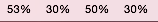
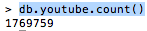
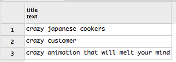

####Zadania
#####2a. Import pliku do bazy danych

Instalacja:
######MongoDB:
Korzystamy z homebrew (coś ala apt-get dla maca):
```sh
brew install mongodb
brew services start mongodb
```
#####PostgreSQL:
jw. korzystamy z homebrew:
```sh
brew install postgres
```

Importowanie bazy danych:
Rozpakujemy zipa pobranego z Mongo DB Json Data - YoutubeVideos (1.12 GB unpacked).
Odpalamy bazy danych i korzystamy z komend do importu.
######MongoDB:
```sh
time mongorestore --drop -d test -c youtube /Users/aidem/Desktop/zadanie1neo4js/Data/media/youtube.bson
```
Zużycie procesora:
Zużycie procesora wachało się pomiędzy 30 a 60% dla rdzeni 1 i 3, oraz 15 - 40% dla pozostałych.



Zużycie pamięci:


Czas importu:


#####PostgreSQL:
Najpierw konwertujemy plik bson do jsona komenda:
```sh
time bsondump youtube.bson > youtube.json
```
Nastepnie korzystamy z pgfuttera (na macu korzystam z curla zamiast wgeta):
```sh
curl -o pgfutter https://github.com/lukasmartinelli/pgfutter/releases/download/v0.3.2/pgfutter_darwin_amd64clear
```
Importujemy:
```sh
./pgfutter --port "5431" --pass aidem123 json youtube.json
```
Zużycie procesora:
Zużycie procesora wachało się pomiędzy 30 a 70% dla rdzeni 1 i 3, oraz 20 - 40% dla pozostałych.


Zużycie pamięci było podobne jak przy imporcie do mongo.

Czas importu:


#####2b. Zliczanie rekordów

######MongoDB:



Czas wyniósł 0

#####PostgreSQL:
```sql
select count(*) from import.youtube;
```
Czas wyniósł 4.45 min

#####2c. Agregacje

######MongoDB:
Instalacja biblioteki dla pythona - pymongo.
```sh
sudo easy_install -U setuptools
sudo python -m easy_install pymongo
sudo python -m easy_install -U pymongo
```


*Wszystkie komendy znajdują się w pliku ["SKRYPT"](aggregationsForMongo.py "SKRYPT").

####### 1. Znajdź użytkownika wrzucającego film o nicku FCLEANDROELEONARDO
```py
>db.youtube.find({'uploader':'FCLEANDROELEONARDO'})
[
	{
		"_id" : ObjectId("55f15665c7447c3da70b5519"),
		"id" : "--0zjb5SZck",
		"uploader" : "FCLEANDROELEONARDO",
		"upload_date" : "2011-08-30",
		"title" : "Leandro & Leonardo - Cerveja - Videoclipe Oficial",
		"description" : "Videoclipe Oficial Da Música \" Cerveja \" Em 1997 ! Pra Matar As Saudades !!!",
		"duration" : "204"
	}
]
```

Realtime:	0m53.017s

####### 2. Zlicz liczbę filmów które w opisie posiadają słowo sex
```py
>db.youtube.count({"description": {'$regex' : '.*' + 'sex' + '.*'}})
11229
```

Realtime:	0m26.898s

####### 3. Znajdź filmy, które trwają dłużej niż 9998 minut
```py
> db.youtube.find({"duration": {"$gt": "9998"}})
[
	{
		"_id" : ObjectId("55f15679c7447c3da71080df"),
		"id" : "apbfC0SmPLo",
		"uploader" : "Shesellssheshells",
		"upload_date" : "2015-02-19",
		"title" : "Lets Stream DreadOut Act 2",
		"description" : "Ghosts with the almost. Co-commentary by VoidBurger (http://twitter.com/voidburger), ChipCheezum (http://twitter.com/chipcheezum), and kcgreenn (https://twitter.com/kcgreenn)\n\nLike this channel? Support it on Patreon! https://www.patreon.com/kamoc",
		"duration" : "9999"
	},
	{
		"_id" : ObjectId("55f1569ac7447c3da719783a"),
		"id" : "lDLM-dXP-KE",
		"uploader" : "UCyoTTxSCZ3vQsaFqlNi1qVg",
		"upload_date" : "2015-05-04",
		"title" : "Star Wars: The Blackened Mantle (The Prequels Rewritten / Recut)",
		"description" : "The Star Wars prequel trilogy (Episodes I-III). Re-edited, interwoven, and entirely rewritten using English subtitles over Japanese audio. A story you haven't seen.\n\n\"Star Wars: The Blackened Mantle\" chronicles the rise of a young Jedi named Anakin Skywalker. Haunted by vivid and prophetic nightmares since he was a slave on Tatooine, Anakin is trained to find peace through the Force by his friend and mentor, Jedi Master Obi-Wan Kenobi - until an act of brutal violence shatters Anakin's fragile grip on his own perilous gift.\n\nThis three-year project was inspired by a challenge unwittingly issued by Peter Sciretta of /Film: was Topher Grace's 85-minute recut trilogy genuinely the \"best possible edit of the Star Wars prequels given the footage released and available?\" To test that claim, the creators of this film turned away from the original English footage - and the original script - and pursued an option based on new research showing how our minds integrate written subtitles with spoken language. This was the result.\n\nNOTE: Unlike many other fan-edits of the prequels, \"The Blackened Mantle\" is not simply three separate films glued back-to-back with the fat cut out. It has proper dramatic pacing, new character arcs, reworked image quality, and a heavily modified plot constructed from a brand new, non-chronological script. It is not necessarily compatible with any Star Wars canon other than the original film trilogy (such as the fantastic \"Clone Wars\" animated series). Apologies go out to fluent Japanese speakers, who will likely not be able to watch the film without muting the audio.\n\nThis is a fan-made, not-for-profit edit of the Star Wars prequels. The creators have no affiliation with Twentieth Century Fox, Lucasfilm Ltd., or Walt Disney Studios.",
		"duration" : "9999"
	},
	{
		"_id" : ObjectId("55f156aac7447c3da71c13fc"),
		"id" : "OG6hdUJf4Qw",
		"uploader" : "KlausTrophobie44",
		"upload_date" : "2013-07-02",
		"title" : "Monkey Safari Live At Fusion Festival 2013 [DJ-SET]",
		"description" : "live mix from the Fusion Festival 2013 on saturday 19-22 at Tanzwiese\n\n\nhttps://soundcloud.com/monkey-safari/",
		"duration" : "9999"
	}
]
```

Realtime	0m18.679s

####### 4. Zlicz liczbę filmów trwających poniżej 1 minuty
```py
> db.youtube.count({"duration": {"$lt": "1"}})
657
```

Realtime	0m9.874s

######PostgreSQL:

####### 1. Wyświetl 3 tytuły które zaczynają się od słowa „crazy”.
```sql
SELECT data->>'title' AS title FROM import.youtube WHERE data->>'title' like ('crazy%') LIMIT 3;
```
Czas 1.2s



####### 2. Wyswietl 10 nazw flmów wraz z datą uploadu, ktore zostały wrzucone przed 14.10.2010 (pomiń 10).
```sql
SELECT data->>'upload_date' AS Upload, data->>'title' AS title FROM import.youtube WHERE data->>'upload_date' < '2010-10-14' LIMIT 10 OFFSET 10;
```
Czas 0.15s


####### 3. Znajdz tytuły filmów wrzuconych przez użytkownika DiSonik.
```sql
SELECT data->>'uploader' AS Uploader, data->>'title' AS title FROM import.youtube WHERE data->>'uploader' = 'DiSonik';
```
Czas 0.18s


#####2d. GeoJson

Pobralem geoJson z informacjami o stanach w ameryce oraz wykaz trzęsień ziemi na świecie w przeciągu ostatnich 30 dni.

Import do mongo poleceniem:
```sh
mongoimport --drop -d test -c zipcodes zips.json
```
Dodajemy geo-indeks:
```sh
> db.states.ensureIndex({"loc": "2dsphere"})
{
	"createdCollectionAutomatically" : false,
	"numIndexesBefore" : 1,
	"numIndexesAfter" : 2,
	"ok" : 1
}
```

Pobieramy jq:
```sh
brew install jq
```

####Tworzenie GeoJsonów

#####a) Tworzymy przykładowe zapytanie, 
Wchodzimy na gejson.io i tworzymy sobie przykładowe punkty. W tym wypadku oznaczyłem cały teren zabudowany wokół Indianopolis, a następnie skopiowałem dane potrzebne mi do wykonania finda w bazie mongo.

Poniższe zapytanie wyświetla mi wszystkie kody pocztowe w obrębie oznaczonego terenu:
```sh
>db.zipcodes.find({loc: {$geoWithin: {$geometry: {type: "Polygon", coordinates: [[
            [ -86.15341186523436, 39.999215966720165 ],
            [ -86.19186401367186, 39.9676482528045   ],
            [ -86.18911743164062, 39.930800820752765 ],
            [ -86.253662109375, 39.929747745342944 ],
            [ -86.28387451171875, 39.902362098539726 ],
            [ -86.28662109375, 39.8517752151841 ],
            [ -86.29074096679688, 39.80959097923673 ],
            [ -86.28936767578125, 39.740986355883564 ],
            [ -86.33880615234375, 39.69239407904182 ],
            [ -86.27151489257812, 39.69450749856091 ],
            [ -86.187744140625, 39.687110247162934 ],
            [ -86.220703125, 39.57288079854952 ],
            [ -86.16439819335938, 39.577114881737586 ],
            [ -86.12182617187499, 39.600397716215824 ],
            [ -86.05728149414062, 39.592990390285024 ],
            [ -85.97763061523438, 39.66491373749128 ],
            [ -85.97625732421875, 39.73570624505104 ],
            [ -85.97076416015625, 39.82752244475985 ],
            [ -85.9625244140625, 39.86653357724533 ],
            [ -85.88836669921874, 39.91289633555756 ],
            [ -85.84991455078125, 39.961332959837826 ],
            [ -86.00921630859375, 40.006579667838615 ],
            [ -86.15341186523436, 39.999215966720165
            ]
            ]]}}}})
```
#####b) Otrzymane wyniki które w skrócie wygladają tak: 
```sh
...
{ "_id" : "46290", "city" : "NORA", "loc" : [ -86.167118, 39.93077 ], "pop" : 75, "state" : "IN" }
{ "_id" : "46280", "city" : "NORA", "loc" : [ -86.13894, 39.938417 ], "pop" : 5281, "state" : "IN" }
{ "_id" : "46032", "city" : "CARMEL", "loc" : [ -86.124545, 39.971232 ], "pop" : 40090, "state" : "IN" }
{ "_id" : "46038", "city" : "FISHERS", "loc" : [ -86.023048, 39.957486 ], "pop" : 11918, "state" : "IN" }
...
```
####Przeklejamy do pliku, a następnie przy pomocy jq parsujemy je do formatu geoJson
```sh
cat indiano.json | jq -c '. | {"type": "Feature","geometry" :{"type": "Point","coordinates":[.loc[0],.loc[1]]},"properties":{_id,city,pop,state}}'
```

####Brakuje nam jednak prefixu, oraz przecinków, poprawiamy to krótkim skryptem:
```sh
#dodaj prefix
echo  "{ \"type\": \"FeatureCollection\", \"features\": [" > $2

#zapytanie
cat $1 |  jq -c '. | {"type": "Feature","geometry" :{"type": "Point","coordinates":[.loc[0],.loc[1]]},"properties":{_id,city,pop,state}}' >> $2

#dodaj sufix
echo "]}" >> $2

#dodaj przecinki
sed -i '' 's/$/,/g' $2
```
####Usuwamy przecinki z pierwszej i ostatniej linijki i nasz plik geojson jest gotowy:

["Kody pocztowe w Indianie"](indiano.geojson "Kody pocztowe w Indianie")

Znajdź 5 kodów pocztowych w promieniu 10 km od Białego Domu
```sh
>db.zipcodes.find({loc: {$near: {$geometry: {type: "Point", coordinates: [-77.03651905059814,38.89834766079331],$maxDistance: 10000}}}}).limit(5)
```

Znajdź wszystkie najbliższe kody pocztowe w promieniu 50km, poczynając od najbliższego brzegu do miasta (pomijając wyspy, odległość 1km wyciągnąłem z google maps).
```sh
>db.zipcodes.find({loc: {$nearSphere: {$geometry: {type: "Point", coordinates: [-74.04453635215759,40.689213094551995],$minDistance: 1000,$maxDistance:50}}}})
```

Wyświetl wszystkie kody pocztowe znajdujące się w obrębie Florydy.
```sh
>db.zipcodes.find({loc: {$geoIntersects: {$geometry: {type: "Polygon", coordinates: [[         [               -81.0791015625,               25.145284610685064             ],             [               -80.31005859375,               25.3241665257384             ],             [               -80.0244140625,               26.60817437403311             ],             [               -80.61767578124999,               27.994401411046148             ],             [               -81.298828125,               29.878755346037977             ],             [               -81.5185546875,               30.41078179084589             ],             [               -83.91357421875,               30.06909396443887             ],             [               -82.880859375,               29.11377539511439             ],             [               -82.63916015625,               28.632746799225856             ],             [               -82.880859375,               27.839076094777816             ],             [               -82.28759765625,               26.745610382199022             ],             [               -82.06787109374999,               26.64745870265938             ],             [               -81.0791015625,               25.145284610685064             ]            ]]}}}})
```


