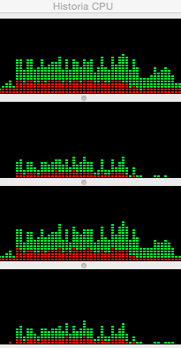
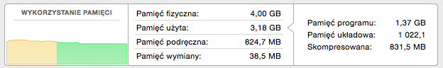
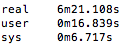
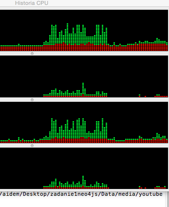
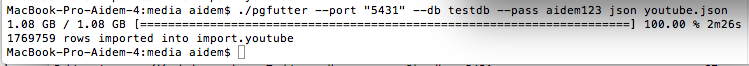

####Zadania
#####2a. Import pliku do bazy danych

Instalacja:
######MongoDB:
Korzystamy z homebrew (coś ala apt-get dla maca):
```sh
	brew install mongodb
	brew services start mongodb
```
#####PostgreSQL:
jw. korzystamy z homebrew:
```sh
	brew install postgres
```

Importowanie bazy danych:
Rozpakujemy zipa pobranego z Mongo DB Json Data - YoutubeVideos (1.12 GB unpacked).
Odpalamy bazy danych i korzystamy z komend do importu.
######MongoDB:
```sh
	time mongorestore --drop -d test -c youtube /Users/aidem/Desktop/zadanie1neo4js/Data/media/youtube.bson
```
Zużycie procesora:
Zużycie procesora wachało się pomiędzy 30 a 60% dla rdzeni 1 i 3, oraz 15 - 40% dla pozostałych.




Zużycie pamięci:



Czas importu:



#####PostgreSQL:


```sh
	time mongorestore --drop -d test -c youtube /Users/aidem/Desktop/zadanie1neo4js/Data/media/youtube.bson
```
Zużycie procesora:
Zużycie procesora wachało się pomiędzy 30 a 60% dla rdzeni 1 i 3, oraz 15 - 40% dla pozostałych.




Zużycie pamięci było podobne jak przy imporcie do mongo.

Czas importu:



